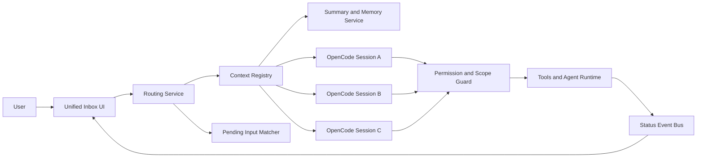

# PRD: Single-Window AI Inbox

Status: Draft  
Date: June 28, 2026

## 1. Summary

Build a single always-open AI chat window that automatically routes user messages to the right underlying context, instead of requiring users to manually manage multiple chats or sessions.

The product should feel like one inbox, not a collection of threads. Under the hood, it will still maintain multiple contexts with separate memory, tools, permissions, and execution state. The system, not the user, is responsible for deciding whether a message should continue current work, revive an earlier task, answer a pending question, or start something new.

The first implementation should use `OpenCode` as the execution substrate and session engine. `Pi` should inform design philosophy where helpful, but not be the initial base platform.

## 2. Background

Current AI interfaces largely expose sessions as the primary interaction model:

- Users manually create new chats.
- Users manually reopen old chats.
- Users must remember where work lives.
- Users must hunt for threads that are waiting on them.

This makes the human do context management work that should belong to the system.

The proposed product flips that model:

- One visible inbox
- Many hidden contexts
- Automatic routing by default
- Human override when needed
- Clear visibility into what is active, blocked, or awaiting input

## 3. Problem Statement

People do not naturally think in chat sessions. They think in tasks, interruptions, reminders, and follow-ups.

Today, users frequently experience:

- Lost work because they forget which session contains it
- Friction when switching topics
- Repeated context re-explanation
- Invisible blocked states across multiple threads
- Cognitive overhead from session maintenance

This is especially painful for users who treat AI as a continuous operating layer across coding, research, planning, writing, and personal tasks.

## 4. Product Thesis

The best AI interface is a single conversational inbox that absorbs context-switching complexity on the user’s behalf.

Users should be able to:

- type naturally into one window at all times
- trust the system to route messages correctly most of the time
- see what the system thinks is happening
- quickly correct mistakes when routing is wrong
- resume paused work without thread hunting

The product should behave more like an operating system for ongoing conversations than like a collection of independent chat logs.

## 5. Product Decision

### 5.1 Base Platform

Use `OpenCode` as the first implementation base.

Reasoning:

- `OpenCode` is MIT-licensed
- it already supports sessions, status, todo state, permissions, summaries, aborts, and forks
- it already has terminal, desktop, web, and IDE surfaces
- it exposes a server-oriented architecture that is friendlier to a custom frontend shell

### 5.2 Design Reference

Use `Pi` as a reference for a lightweight, composable agent core and developer ergonomics, not as the primary first implementation base.

Reasoning:

- `Pi` appears cleaner and less opinionated as an agent harness
- it would require more product infrastructure to reach the target UX
- this product’s first challenge is orchestration and interface, not just agent execution

## 6. Goals

### 6.1 Primary Goals

- Eliminate manual session switching for the common case
- Make context routing automatic, visible, and correctable
- Surface blocked and pending contexts without requiring navigation
- Preserve separate context state, permissions, and tool boundaries
- Reduce cognitive overhead for users who work with AI continuously

### 6.2 Secondary Goals

- Improve task resumption across interruptions
- Allow multiple active contexts without cluttering the main experience
- Create a platform that can later expand beyond coding workflows

## 7. Non-Goals

- Replacing all underlying session boundaries with one giant context
- Perfect autonomous memory or fully invisible state
- Solving every personal knowledge management use case in v1
- Building broad multi-user collaboration in the initial release
- Supporting every possible tool integration in the MVP

## 8. Target Users

### 8.1 Primary User

A power user who uses AI throughout the day across several ongoing tasks and dislikes managing multiple chat threads manually.

Examples:

- developer jumping between code, docs, and planning
- founder switching between product, ops, writing, and research
- generalist knowledge worker using AI as a daily workbench

### 8.2 Secondary User

A mainstream user who wants AI to feel simple and persistent, without learning the mental model of sessions.

## 9. Jobs To Be Done

- "Help me continue what I was just doing."
- "Help me jump back to that thing from yesterday without me finding the thread."
- "Tell me what you need from me right now."
- "Let me answer open questions quickly without losing my current flow."
- "Start something new without making me think about session setup."

## 10. Product Principles

### 10.1 The system manages context

The default interaction should never require the user to choose a session first.

### 10.2 Routing must be inspectable

The user should not need to manage contexts, but should always be able to see and override what the system chose.

### 10.3 Separate work should remain separate

Contexts should keep their own summaries, permissions, tools, and histories even when surfaced through one inbox.

### 10.4 Pending states must be visible

If the system is blocked or waiting for user input, it should surface that in a task rail rather than burying it in a hidden session.

### 10.5 Wrong routing is inevitable

The product must make recovery fast, cheap, and unsurprising.

## 11. User Experience Overview

### 11.1 Primary Surfaces

- `Unified Inbox`: the main transcript and only composer
- `Task Rail`: compact view of contexts in `Needs You`, `Running`, `Recent`, and `Done`
- `Context Drawer`: inspectable list of all contexts with status and summaries
- `Context Badge`: small visible label on each assistant reply indicating active context

### 11.2 Core Mental Model

The user sees one inbox. The system sees many contexts.

Each new message is classified into one of four actions:

- continue the active context
- revive a previous context
- answer a pending question in a blocked context
- create a new context

## 12. Detailed UX Flows

### 12.1 Flow A: Continue Current Work

1. User types a follow-up in the main composer.
2. Router confidence is high that the message belongs to the current context.
3. Message is appended to that context.
4. Assistant replies with a visible label such as `Gumzo PRD · auto-routed`.

Success criteria:

- no context picker is shown
- user does not experience session friction

### 12.2 Flow B: Revive Earlier Work

1. User types: "Go back to the SwiftUI issue from yesterday."
2. Router matches a recent dormant context.
3. The inbox switches to that context transcript.
4. A small inline system notice explains the switch.

Success criteria:

- user resumes earlier work without using a history sidebar

### 12.3 Flow C: Answer Pending Input

1. Another context is waiting on a question such as "Which database should I use?"
2. User types: "Use Postgres."
3. Router identifies an unresolved question in a blocked context.
4. Reply is attached there and execution resumes.

Success criteria:

- pending input can be answered from the main inbox
- the task rail updates from `Needs You` to `Running`

### 12.4 Flow D: Start New Work

1. User types a message unrelated to active contexts.
2. Router confidence for existing contexts is low.
3. System starts a new context automatically.
4. The new context appears in `Recent`.

Success criteria:

- new tasks feel effortless
- creation of a new context does not require explicit setup

### 12.5 Flow E: Ambiguous Routing

1. User types a message that could match multiple contexts.
2. Router confidence is medium and no strong pending item match exists.
3. Inline chooser appears with 2-3 likely routes plus `Start new`.
4. User selects one.

Success criteria:

- the system asks only when uncertainty is meaningful
- the choice is fast and low-friction

### 12.6 Flow F: Wrong Route Recovery

1. System auto-routes incorrectly.
2. User clicks `Move message`.
3. Message is reassigned to another context.
4. Router stores correction feedback.

Success criteria:

- recovery takes one interaction
- correction is visible and reversible

## 13. Information Architecture

### 13.1 Inbox Sections

- transcript area
- context badge and status strip
- composer
- lightweight system notices for route changes

### 13.2 Task Rail Sections

- `Needs You`
- `Running`
- `Recent`
- `Done`

Each task item should show:

- title
- short summary
- current state
- last updated time
- whether it has pending input or approval needs

## 14. Functional Requirements

### 14.1 Context Routing

The system must:

- score candidate contexts for each incoming message
- support auto-route, disambiguation, and new-context creation
- use semantic similarity, recency, unresolved questions, workspace match, and named entities as inputs
- learn from user corrections

### 14.2 Context State

Each context must store:

- title
- status
- summary
- full transcript reference
- active tools and permissions
- pending questions
- timestamps
- scope markers such as repo, app, account, or domain

### 14.3 Pending Input Handling

The system must:

- detect when a context is blocked on user input
- promote blocked contexts into `Needs You`
- allow users to answer from the global composer
- map answers to the correct pending question when confidence is high

### 14.4 Visibility and Override

The system must:

- show the chosen context on every assistant response
- allow moving a message to another context
- allow explicitly pinning a context temporarily
- allow inspecting all contexts without making that the primary workflow

### 14.5 Memory and Summarization

The system must:

- maintain rolling summaries for each context
- compress stale contexts for efficient retrieval
- separate global user preferences from context-specific memory

### 14.6 Permissions and Safety

The system must:

- preserve context-level permission state
- avoid leaking information across unrelated contexts
- require explicit confirmation before using tools or data from another scoped context when ambiguity exists

## 15. Non-Functional Requirements

- Routing decision should feel immediate in the UI.
- Task rail status should update in near real time.
- Context switch should not feel like a full page navigation.
- Underlying session boundaries should remain debuggable by developers.
- The product should support future web, desktop, and IDE surfaces from the same backend model.

## 16. Routing Model

### 16.1 Signals

- semantic similarity to context summary
- semantic similarity to recent turns
- recency and activity level
- explicit entity mentions like repo names or feature names
- pending question match
- current workspace or app scope
- prior manual routing corrections

### 16.2 Decision Policy

- high confidence: auto-route
- medium confidence: ask inline
- low confidence: start new

### 16.3 Safety Policy

If the best candidate context has different permissions, tools, or data boundaries from the current visible context and the user message is ambiguous, the system should prefer disambiguation over silent routing.

## 17. Edge Cases

- Two contexts ask similar pending questions
- User intentionally wants a fresh start on an old topic
- User answers a pending question with a very short message like "yes"
- One context is still running while the user begins another
- A context requires a tool approval while another context is active
- The same entity name appears in multiple projects
- The system auto-routes correctly semantically but violates user expectation emotionally

## 18. Architecture Overview

### 18.1 Proposed Components

- `Unified Inbox UI`
- `Routing Service`
- `Context Registry`
- `Pending Input Matcher`
- `Summary and Memory Service`
- `Session Runtime Adapter`
- `Status Event Bus`
- `Permission and Scope Guard`

### 18.2 Architecture Diagram

### 18.3 OpenCode Mapping

For MVP, each context maps to one underlying `OpenCode` session.

Use `OpenCode` for:

- execution runtime
- session persistence
- permission model
- status and todo updates
- summarization hooks where available

Add product-specific layers for:

- global inbox
- routing
- pending-input matching
- cross-session visibility
- correction learning

## 19. Data Model

### 19.1 Context

- `id`
- `title`
- `status`
- `summary`
- `session_id`
- `scope`
- `pending_items`
- `last_active_at`
- `created_at`
- `updated_at`

### 19.2 Pending Item

- `id`
- `context_id`
- `prompt`
- `type` such as `question`, `approval`, or `missing-data`
- `status`
- `created_at`
- `resolved_at`

### 19.3 Route Event

- `id`
- `message_id`
- `chosen_context_id`
- `candidate_context_ids`
- `confidence`
- `decision_type`
- `was_corrected`

## 20. MVP Scope

### 20.1 In Scope

- single inbox shell
- context rail
- visible route badges
- auto-route for high-confidence cases
- inline disambiguation for medium-confidence cases
- new-context creation
- pending-input resurfacing
- manual route correction
- mapping contexts to `OpenCode` sessions

### 20.2 Out of Scope

- advanced long-term personal memory
- proactive autonomous task scheduling
- cross-user shared context spaces
- full multimodal orchestration
- universal integrations beyond what `OpenCode` already makes practical

## 21. Success Metrics

### 21.1 Product Metrics

- reduction in manual session switching events
- percentage of messages successfully auto-routed without correction
- percentage of pending items answered from the inbox
- task resumption speed after interruption
- daily active contexts per user without drop in satisfaction

### 21.2 Quality Metrics

- route correction rate
- ambiguous-route prompt rate
- incorrect pending-input attachment rate
- privacy or boundary violation incidents

## 22. Risks

### 22.1 Hidden Confusion

If routing happens invisibly, users may feel the system is unpredictable.

Mitigation:

- visible context badges
- route notices
- fast correction flow

### 22.2 Boundary Leakage

If contexts share too much memory or tool access, the product can feel unsafe.

Mitigation:

- explicit scope markers
- permission guard
- conservative routing in sensitive cases

### 22.3 Over-Reliance On Summaries

Poor summarization can cause wrong routing or shallow recall.

Mitigation:

- combine summaries with recency and unresolved-question signals
- keep raw transcript references available

### 22.4 UX Overload

If the task rail becomes a second inbox to manage, the product recreates the original problem.

Mitigation:

- compact categories
- only surface meaningful states
- avoid exposing raw implementation details

## 23. Open Questions

- Should the inbox show one continuous transcript across contexts, or switch the visible transcript to the routed context while preserving one composer?
- When should the system pin the active context temporarily to avoid over-switching?
- How aggressively should the system auto-route short messages like `yes`, `do it`, or `use Postgres`?
- Should users be able to manually create named contexts at all in v1?
- Should route correction train a user-specific model, a heuristic profile, or both?

## 24. Recommended MVP Direction

The recommended first version is:

- build a new frontend shell on top of `OpenCode`
- preserve underlying session semantics
- introduce a router and context registry above sessions
- ship a small task rail with `Needs You`, `Running`, and `Recent`
- optimize first for trust and visibility, not maximum automation

## 25. Milestones

### Phase 0: Validation

- verify `OpenCode` session and status APIs needed for routing
- prototype context rail and inbox shell
- evaluate route quality using sample transcripts

### Phase 1: MVP Shell

- unified inbox UI
- session-backed context registry
- route badges
- task rail

### Phase 2: Routing

- semantic matching
- pending-input matcher
- inline disambiguation
- manual correction flow

### Phase 3: Hardening

- permission and scope guard
- better summaries
- telemetry and quality measurement

## 26. References

- `OpenCode`: https://github.com/sst/opencode
- `OpenCode Docs`: https://opencode.ai/docs
- `Pi`: https://pi.dev/
- `Pi Repo`: https://github.com/earendil-works/pi/tree/main/packages/coding-agent
